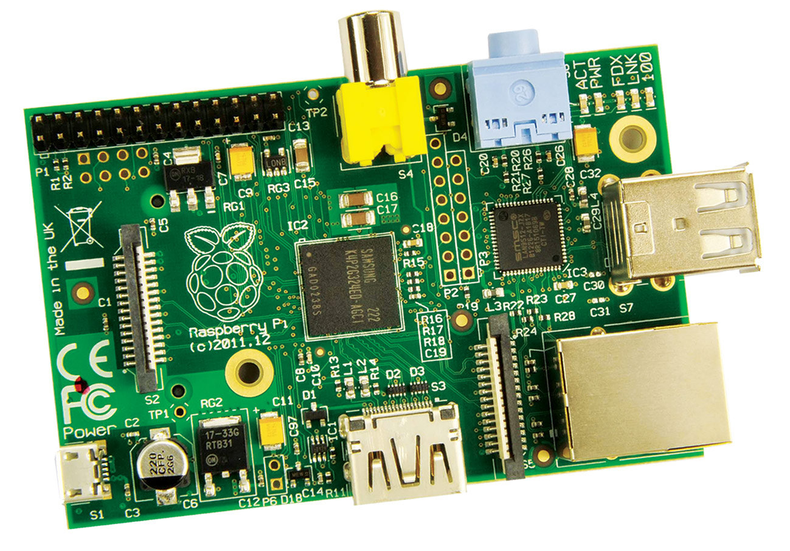
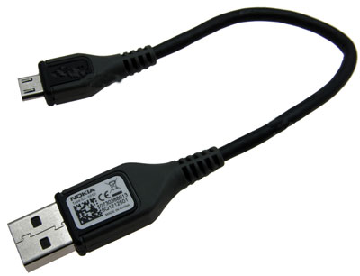
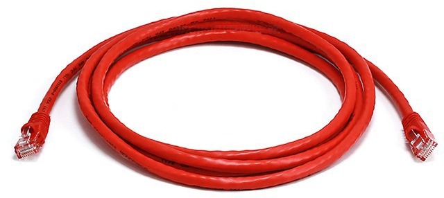
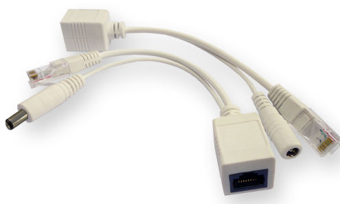
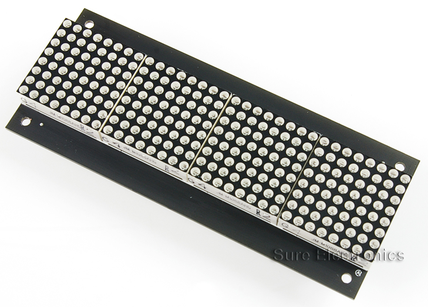
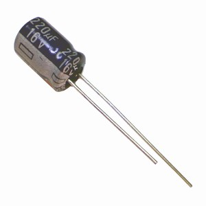

#Message Board


This project was inspired by London Hackspace's [Notification Board](https://wiki.london.hackspace.org.uk/view/Project:Notification_Board) but with modifications to suit the Cambridge [Makespace](http://makespace.org/).

The primary modification was to remove the need for separate computer , this was done by replacing the Arduino with an ethernet shield with a Raspberry Pi. Whilst it probably wasn't the most efficient use of computing power I had a Raspberry Pi free and I wanted to use it for a worthwhile project. In addition it's spare power could be used to increase the functionality of the message board by having scripts running 24/7 to display useful informaition about local food, transport and weather as well as displaying current and future events.

The hardest part of the project was ensuring that the LED dot matrix displays were correctly initialised as the same part number has 2 varients requiring different initialisation sequences.

##Setting up the Message Board
###The Hardware


####Get the Parts
* 1x Raspberry Pi B



* 1x 20cm USB micro cable



* 1x ethernet cable



* 1x set of passive Power Over Ethernet (POE) splitter cables



* 1x Car USB adaptor


* 1x RPi & power to LED Display cable


* 4x Sure Electronics 8x32 LED Displays



* 1x 220uF 16V electrolytic capacitor



####Making the Custom Cable
* 18x female crimps
* 1x 2x13 way female socket
* 1x 2x8 way female socket
* 1x 150mm SWG30 multicore red wire
* 2x 150mm SWG30 multicore black wire
* 1x 150mm SWG30 multicore green wire
* 1x 150mm SWG30 multicore yellow wire
* 1x 150mm SWG30 multicore blue wire
* 1x 150mm SWG30 multicore purple wire
* 1x 150mm SWG30 multicore white wire
* 1x 150mm SWG30 multicore orange wire

1. Strip ~ 2mm from each end of every cable
2. Crimp each end with a female crimp
3. Insert the following wires into the 2x13 socket
 * A black wire into pin 25
 * The green wire into pin 19
 * The yellow wire into pin 23
 * The blue wire into pin 24
 * The purple wire into pin 26
 * The white wire into pin 18
 * The orange wire into pin 22
4. Insert the following wires into the 2x8 socket
 * The free red wire into pin 16
 * The free black wire into pin 15
 * The black wire into pin 8
 * The green wire into pin 7
 * The yellow wire into pin 5
 * The blue wire into pin 3
 * The purple wire into pin 1
 * The white wire into pin 2
 * The orange wire into pin 4
5. Insert the following wires into 1x1 sockets
 * The remaining red wire
 * The remaining black wire
6. Optionally use spiral wrap or heatshink and braiding to keep the loose wires together.

####Connecting it all Together
Connect the parts as shown in the image below:


###Software
Type/copy the following lines into your Raspberry Pi's terminal:
```bash
sudo apt-get update
sudo apt-get upgrade
git clone git://git.drogon.net/wiringPi
git clone git://github.com/pinski1/MessageBoard
cd wiringPi
./build
cd ~/MessageBoard
./compile.sh
```
Assuming everything is connected properly you should now see the time & date scrolling across the message board.

As the message board is likely to be the only display connected to your Raspberry Pi it would be helpful to have that display the IP on boot up. I took the instructions from Jim Schrempp which can be found [here](http://www.jimschrempp.com/features/computer/rpi_boot_email.htm) and modified them to suit.
```bash
sudo cp /Scripts/boot_disp_ip.sh /etc/init.d
sudo update-rc.d boot_disp_ip.sh defaults
```

Later revisions of this project will have a python script which can run though scripts to allow for a display that auto-updates with useful information.

<!---
```bash
cd ~/MessageBoard/Scripts
git clone https://code.google.com/p/feedparser/
cd feedparser
sudo python setup.py install
```
-->

Messages can be sent to the board in the following format: `sudo write_disp -s 75 -m "Hello World"` The '-s 75' is option and sets a number of milliseconds to wait between each vertical line, 50-75 is an ideal speed, 0 milliseconds freezes the text on the display and anything larger than 5000 generates an error. The essage is preceded by '-m' and can be anything e.g. `-m "`date`"` will print a formatted string of the time and date.

##License Information

The LED Dot-Matrix Displays are closed source.

wiringPi is released under [GNU LGPLv3](http://www.gnu.org/copyleft/lesser.html). More information available [here](http://wiringpi.com/).

The C code is released under [Creative Commons Share-alike 3.0](http://creativecommons.org/licenses/by-sa/3.0/).

The cable is released under [Creative Commons Share-alike 3.0](http://creativecommons.org/licenses/by-sa/3.0/).

